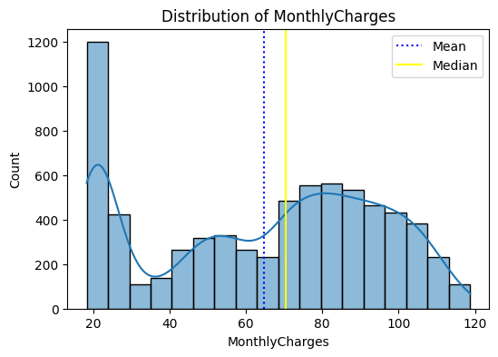
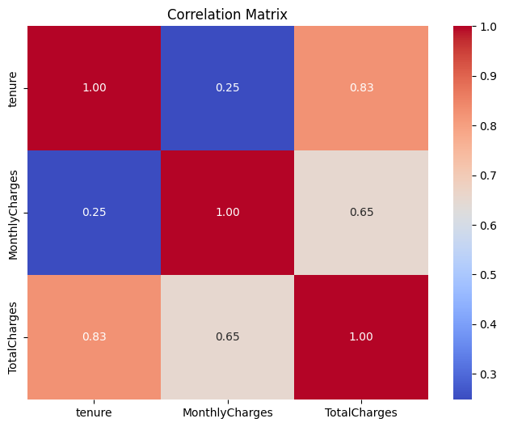

# Customer Churn Prediction

This project focuses on predicting customer churn for a telecommunications company using machine learning models. The dataset contains various features such as customer demographics, service usage, and billing information, which are used to predict whether a customer will churn (leave the service).

## Table of Contents
- [Project Overview](#project-overview)
- [Dataset](#dataset)
- [Data Preprocessing](#data-preprocessing)
- [Exploratory Data Analysis (EDA)](#exploratory-data-analysis-eda)
- [Model Training](#model-training)
- [Results](#results)
- [Technologies Used](#technologies-used)
- [How to Run](#how-to-run)

---

## Project Overview
The goal of this project is to predict customer churn using various machine learning models. The project involves:
- Data cleaning and preprocessing.
- Exploratory Data Analysis (EDA) to understand the dataset.
- Handling class imbalance using **SMOTE** (Synthetic Minority Oversampling Technique).
- Training and evaluating multiple machine learning models, including Decision Tree, Random Forest, KNN, Support Vector Machine, and Logistic Regression.

---

## Dataset
The dataset used in this project is the **Telco Customer Churn Dataset** from Kaggle, which contains the following features:
- **customerID**: Unique identifier for each customer.
- **gender**: Gender of the customer (Male/Female).
- **SeniorCitizen**: Whether the customer is a senior citizen (0 or 1).
- **Partner**: Whether the customer has a partner (Yes/No).
- **Dependents**: Whether the customer has dependents (Yes/No).
- **tenure**: Number of months the customer has stayed with the company.
- **PhoneService**: Whether the customer has a phone service (Yes/No).
- **MultipleLines**: Whether the customer has multiple lines (Yes/No/No phone service).
- **InternetService**: Type of internet service (DSL, Fiber optic, No).
- **OnlineSecurity**: Whether the customer has online security (Yes/No/No internet service).
- **OnlineBackup**: Whether the customer has online backup (Yes/No/No internet service).
- **DeviceProtection**: Whether the customer has device protection (Yes/No/No internet service).
- **TechSupport**: Whether the customer has tech support (Yes/No/No internet service).
- **StreamingTV**: Whether the customer has streaming TV (Yes/No/No internet service).
- **StreamingMovies**: Whether the customer has streaming movies (Yes/No/No internet service).
- **Contract**: Type of contract (Month-to-month, One year, Two year).
- **PaperlessBilling**: Whether the customer has paperless billing (Yes/No).
- **PaymentMethod**: Payment method (Electronic check, Mailed check, Bank transfer, Credit card).
- **MonthlyCharges**: Monthly charges for the customer.
- **TotalCharges**: Total charges for the customer.
- **Churn**: Target variable indicating whether the customer churned (Yes/No).

---

## Data Preprocessing
- **Handling Missing Values**: Missing values in the `TotalCharges` feature were replaced with `0.0`.
- **Encoding Categorical Variables**: Categorical features were label encoded using `LabelEncoder`.
- **Handling Class Imbalance**: The dataset was imbalanced, with only 27% of customers churning. **SMOTE** was used to balance the dataset by oversampling the minority class.

---

## Exploratory Data Analysis (EDA)
- **Distribution of Features**: Histograms and box plots were used to understand the distribution of numerical features like `tenure`, `MonthlyCharges`, and `TotalCharges`.
- 

- **Geographical Visualization**: Scatter plots were used to visualize the relationship between `MonthlyCharges` and `Churn`.
- **Correlation Analysis**: A correlation matrix was used to identify the relationship between numerical features.

- **Count Plots**: Count plots were used to visualize the distribution of categorical features.

---

## Model Training
Five models were trained and evaluated:
1. **Decision Tree**: Achieved an accuracy of **78%**.
2. **Random Forest**: Achieved an accuracy of **84%**.
3. **K-Nearest Neighbors (KNN)**: Achieved an accuracy of **77%**.
4. **Support Vector Machine (SVM)**: Achieved an accuracy of **64%**.
5. **Logistic Regression**: Achieved an accuracy of **79%**.

The **Random Forest** model performed the best and was selected for further evaluation.

---

## Results
- **Random Forest Model**:
  - **Accuracy**: 77.86%
  - **Confusion Matrix**:
    - True Positives (TP): 219
    - True Negatives (TN): 878
    - False Positives (FP): 158
    - False Negatives (FN): 154
  - **Classification Report**:
    - Precision (Class 0): 0.85
    - Recall (Class 0): 0.85
    - F1-Score (Class 0): 0.85
    - Precision (Class 1): 0.58
    - Recall (Class 1): 0.59
    - F1-Score (Class 1): 0.58
---

## Technologies Used
- **Python**: Primary programming language.
- **Pandas**: Data manipulation and analysis.
- **NumPy**: Numerical computations.
- **Matplotlib & Seaborn**: Data visualization.
- **Scikit-learn**: Machine learning models and evaluation.
- **SMOTE**: Handling class imbalance.
- **Pickle**: Saving and loading models and encoders.
- 
---

## Future Work
- Experiment with more advanced models like Gradient Boosting or Deep Learning.
- Perform hyperparameter tuning to improve model performance.
